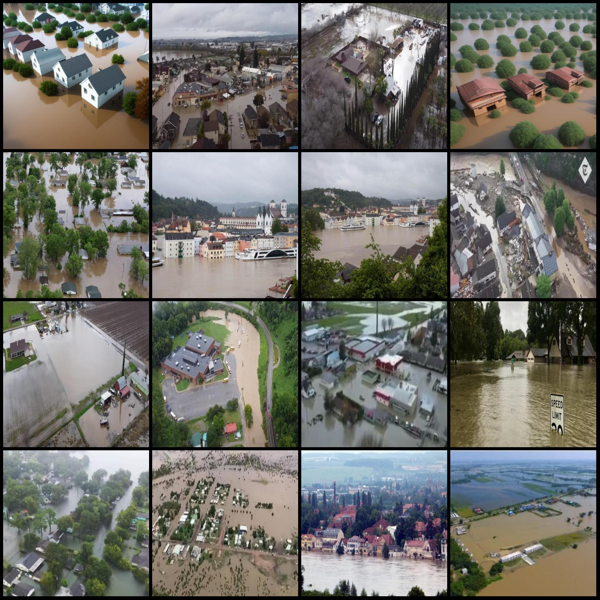
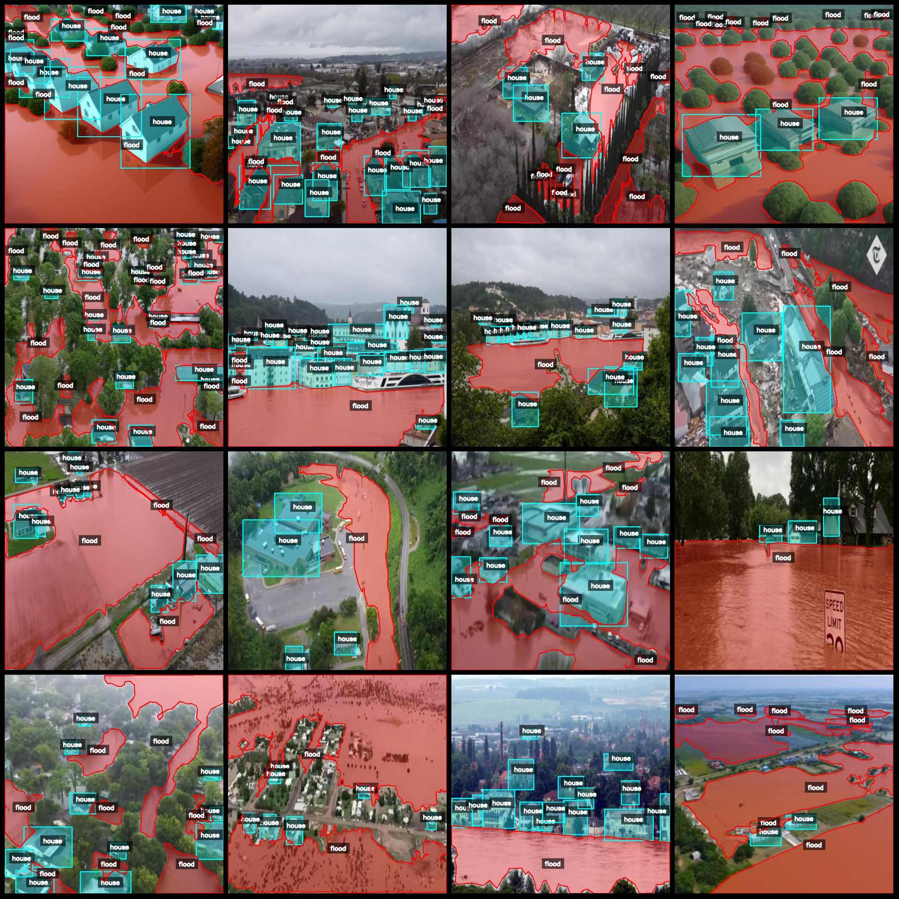
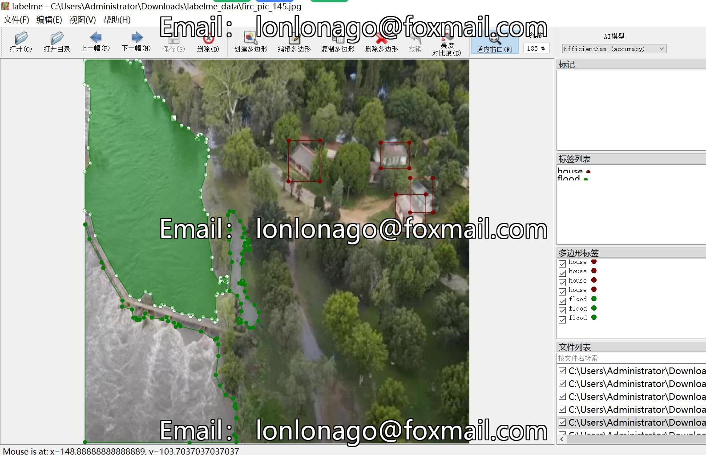

# Drone Perspective Flood Identification and Segmentation Dataset - LabelMe Format: 1173 Images in 2 Categories

The dataset format is LabelMe (excluding mask files, only including JPG images and corresponding JSON files). The number of images (JPG file counts) is 1173. The number of annotations (JSON file 
counts) is also 1173. There are 2 categories of annotations: ["flood", "house"]. Each category has a count of boxes: 
- Count for flood = 7310
- Count for house = 14861
- Total box count = 22171

Annotation tools used: labelme=5.5.0
Image resolution: 640x640
Annotation rules: Polygons are drawn around the category for each image.
Important note: You can edit the dataset using LabelMe. The JSON dataset needs to be converted into either mask or YOLOF format for semantic segmentation or instance segmentation.
Special declaration: This dataset does not guarantee the accuracy of any trained models or weight files.
Image preview:
Annotation example:
Randomly selected 16 images:
Annotation drawing result:
LabelMe editing image example:

## Images

Here is a pay link on Stripe ( https://buy.stripe.com/3cs8yP7sY87d0vu9AB ). Please contact me lonlonago@foxmail.com after funding $89, and I will send you a complete data files , thank you!

